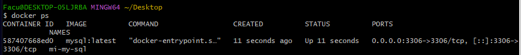

# Actividad Práctica: Contenedores con Docker

## Descripción

Este documento detalla la resolución de la actividad práctica sobre contenedores, correspondiente a la **Unidad de Contenedores** del Seminario de DevOps.

El objetivo de la práctica fue adquirir las habilidades fundamentales para gestionar el ciclo de vida de un contenedor de Docker, utilizando como caso de estudio la imagen oficial de **MySQL Server**. Se cubrieron los siguientes puntos: instalación de Docker, creación de contenedores, mapeo de puertos, gestión de la persistencia de datos con volúmenes, e interacción con el contenedor desde herramientas externas.

---

## Proceso de Ejecución y Comandos

A continuación, se explicitan los comandos utilizados en la terminal (`Git Bash` / `PowerShell`) para completar cada paso de la consigna.

### 1. Instalación de Docker Desktop

Se descargó e instaló Docker Desktop para Windows desde el sitio web oficial.

### 2. Creación del Contenedor MySQL

Se utilizó el comando `docker run` para crear e iniciar el contenedor a partir de la imagen `mysql:latest` de Docker Hub, aplicando los parámetros necesarios para su correcta ejecución y persistencia.

```bash
docker run --name mi-mysql-db -e MYSQL_ROOT_PASSWORD=mi-clave-secreta -p 3306:3306 -v mysql_data:/var/lib/mysql -d mysql:latest
```

- --name mi-mysql-db: Asigna un nombre legible al contenedor.
- -e MYSQL_ROOT_PASSWORD=...: Establece la contraseña del usuario root, un requisito de la imagen.
- -p 3306:3306: Mapea el puerto 3306 del contenedor al puerto 3306 de la máquina local.
- -v mysql_data:/var/lib/mysql: Crea un volumen llamado mysql_data para garantizar la persistencia de los datos.
- -d: Ejecuta el contenedor en modo detached (segundo plano).



Muestra la terminal después de ejecutar el comando docker ps, donde se vea el contenedor mi-mysql-db en estado "Up".

---

### 3. Interacción con el Servidor MySQL

a) Vía `docker exec`
Se accedió a la consola de MySQL dentro del contenedor para verificar su funcionamiento interno.

```bash
docker exec -it mi-mysql-db mysql -u root -p
```


Muestra la terminal después de ejecutar el comando anterior, ya dentro del prompt mysql>.

b) Vía MySQL Workbench
Se estableció una conexión desde una herramienta de escritorio externa para simular un entorno de desarrollo real.

- Detalles de Conexión:
    - Host: 127.0.0.1
    - Port: 3306
    - Username: root

Se creó con éxito una base de datos de prueba (prueba_docker), una tabla (test) y se insertó un registro.


Muestra la interfaz de MySQL Workbench con la conexión establecida, la base de datos y la tabla creadas en el panel izquierdo, y el resultado de la consulta SELECT * FROM prueba_docker.test; en el panel derecho, mostrando la fila insertada.

---

### 4. Pruebas de Persistencia y Ciclo de Vida

Se verificó el comportamiento del contenedor y la persistencia de los datos al detenerlo y reiniciarlo.
a) Detención del Contenedor

```bash
docker stop mi-mysql-db
```

Tras ejecutar este comando, se comprobó en MySQL Workbench que la conexión fallaba, validando que el servicio se había detenido correctamente.


Muestra el mensaje de error de conexión en MySQL Workbench después de haber detenido el contenedor.

b) Reinicio y Verificación de Datos

```bash
docker start mi-mysql-db
```

Después de reiniciar el contenedor, se estableció nuevamente la conexión desde MySQL Workbench y se ejecutó una consulta sobre la tabla test. Se comprobó que el registro insertado previamente seguía presente, validando el correcto funcionamiento del volumen de Docker.


Similar a la captura del punto 3b, mostrando de nuevo el resultado exitoso de la consulta SELECT *, demostrando que los datos sobrevivieron al reinicio.

---

### Conclsión
La práctica se completó con éxito, cubriendo todos los puntos de la consigna y demostrando una comprensión fundamental del ciclo de vida de los contenedores de Docker, el mapeo de puertos y, crucialmente, la gestión de la persistencia de datos a través de volúmenes.

---